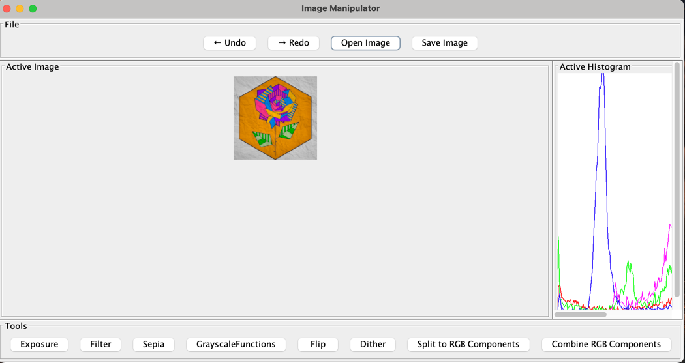

# How to use this application :

## —> Using Console

### - load fractal.ppm and call it 'fractal'

`load res/images/fractal.ppm fractal`

### - brighten fractal by adding 10

`brighten 10 fractal fractal-brighter`

### - flip fractal vertically

`vertical-flip fractal fractal-vertical`

### - flip the vertically flipped fractal horizontally

`horizontal-flip fractal-vertical fractal-vertical-horizontal`

### - create a greyscale using only the value component, as an image fractal-greyscale

`greyscale value-component fractal fractal-greyscale`

### - save fractal-brighter

`save res/images/fractal-brighter.ppm fractal-brighter`

### - save fractal-greyscale

`save res/images/fractal-gs.ppm fractal-greyscale`

### - overwrite fractal with another file

`load res/images/upper.ppm fractal`

### - give the koala a red tint

`rgb-split fractal fractal-red fractal-green fractal-blue`

### - brighten just the red image

`brighten 50 fractal-red fractal-red`

### - combine them back, but by using the brightened red we get a red tint

`rgb-combine fractal-red-tint fractal-red fractal-green fractal-blue`

### - save the red tinted image

`save res/images/fractal-red-tint.ppm fractal-red-tint`

## New Features added :

### - load a png Image

`load res/images/flower.png flower-png`

### - load a jpeg Image

`load res/images/flower.jpeg flower-jpeg`

### - load a bmp Image

`load res/images/flower.bmp flower-bmp`

### - sepia-tone an Image

`sepia-tone fractal fractal-sepia`

### - blur an Image

`blur fractal-sepia fractal-blur-sepia`

### - stack blur on the same Image

`blur fractal-blur-sepia fractal-blur2-sepia`

### - sharpen an Image

`sharpen fractal fractal-sharpened`

### - stack sharpen on the same Image

`sharpen fractal-sharpened fractal-sharpened2`

### - produce a dithered version of an Image

`dither fractal fractal-dithered`

### - loading image in one format, performing operations on it and saving it in another format

`load res/images/fractal.bmp fractal`

`sharpen fractal fractal-sharpened`

`blur fractal fractal-blurred`

`sepia-tone fractal-blurred fractal-blurred-sepia`

`save res/images/fractal-blurred-sepia.png fractal-blurred-sepia`

## —> Using GUI
Open the image from `res/images/flower.ppm` or `res/images/flower.jpeg` or `res/images/flower.png` or `res/images/flower.bmp`
1. **Exposure** - Used to brighten or darken the
    Give +ve values for brightening and -ve values for darkening the image.
2. **Filter** - Used to _Blur_ or _Sharpen_ an image.
3. **GreyscaleFunctions** — This button is used to turn the image into a greyscale image using one of the below methods.
   1. value-component — Convert a rgb image to greyscale using the value component.
   2. luma-component — Convert a rgb image to greyscale using the luma component.
   3. intensity-component — Convert a rgb image to greyscale using the intensity component.
   4. red-component — Convert a rgb image to greyscale using the red component.
   5. green-component — Convert a rgb image to greyscale using the green component.
   6. blue-component — Convert a rgb image to greyscale using the blue component.
4. **Dither** - This button dithers the existing image.
5. **Flip** - The button lets us flip an image _horizontally_ or _vertically_.
6. **Sepia** - This button add a sepia-tone to the image. 
7. **Split to RGB Components** - This button lets us split the rgb into a single channel greyscale image of red, greed or blue component.
8. **Combine RGB Components** - This button lets us combine the rgb into a 3 channel rgb image of red, greed or blue component.
9. **← Undo** - This button is used to revert the latest change to an image.
9. **→ Redo** -  This button is used to repeat the operation which was previously undone.
10. **Open a file** - This button lets us load an image to the application.
11. **Save a file** - This button is used to save the latest image. 

